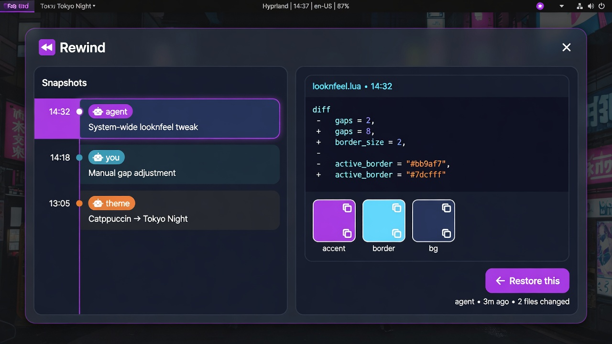

# Undo

Super+Z for the [Omarchy](https://omarchy.org/) desktop. Close the wrong window, it comes back on the same workspace. An agent rewrites `shell.json`, Super+Z puts it back.

One stack. One key.



## Install

```bash
omarchy plugin add https://github.com/Esegnorelli/omarchy-rewind.git --enable
```

The plugin appends two binds to `~/.config/hypr/bindings.lua` if `SUPER + Z` is free:

| Key | Action |
|-----|--------|
| Super+Z | Undo the last closed window or config burst |
| Super+Shift+Z | Open the history overlay |

Left-click the bar icon to undo. Right-click opens history.

## Remove

```bash
omarchy plugin disable esegnorelli.undo
omarchy plugin remove esegnorelli.undo --yes
```

Delete the `-- esegnorelli.undo` block from `~/.config/hypr/bindings.lua`.

Optional: `rm -rf ~/.local/share/omarchy-rewind ~/.local/state/omarchy/undo-stack.json`

## What it remembers

- Closed windows: class, command, workspace, and the working directory for Ghostty, Alacritty, Kitty, and foot
- Config bursts in `~/.config/hypr` and Omarchy shell/theme/plugin files (same store as before)

The stack is capped at 50 and clears on reboot. Browser tabs are the browser's problem; Undo reopens the window.

## Requirements

Omarchy Quattro, `inotifywait`, `node` on `PATH`. No accounts. No network.

## License

MIT
